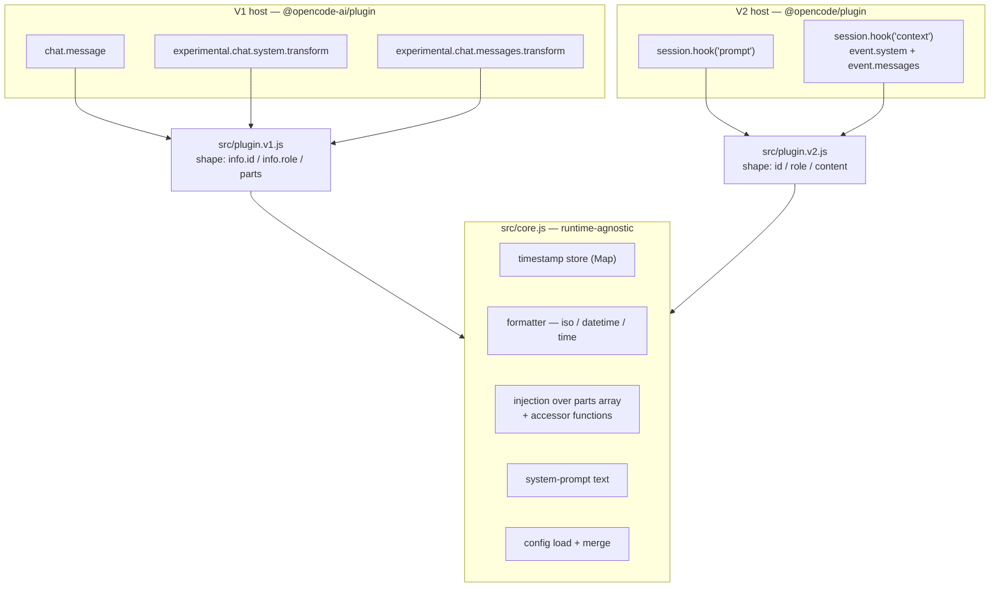

## Context

See `proposal.md` — Why. This document covers only how the port is structured.

Today `src/index.js` is a single 146-line V1 factory holding everything: config loading, the
timestamp formatter, the `Map` timestamp store, the system-prompt text, and three hook bodies.
Nothing in it is V1-specific except the three hook signatures and the two message/system shapes
they operate on. That ratio — a large runtime-agnostic core wrapped in a thin runtime-specific
skin — is what makes the standard three-module split (`core.js` + two adapters) the obvious
shape here, identical to the five sibling ports (`opencode-use`, `opencode-auto-instruct`,
`opencode-redact`, `opencode-notify`, `opencode-openspec`).

The behavioural contract being preserved is in `openspec/specs/timestamps/spec.md` and
`openspec/specs/plugin/spec.md`. The single most important invariant, which drives the central
decision below, is: **the timestamp appears only in the model-facing copy of a message, never in
the copy the host stores or displays.**

### Ground truth (verified against the installed `@opencode/plugin@2.0.5` types)

| Fact | Source |
|---|---|
| `SessionPrompt` exposes `readonly messageID` directly | `@opencode/plugin/dist/promise/session.d.ts:15` |
| `SessionPrompt.prompt` is `Types.DeepMutable<PromptInput.Prompt>` | ibid. `:16` |
| `PromptInput.Prompt.text` is a flat `string`, not a parts array | `@opencode/schema/dist/prompt-input.d.ts` |
| `SessionContext` carries **both** `system: Array<SystemPart>` and `messages: Array<Message>` | `session.d.ts:22–35` |
| `Message` is `{ id?, role, content[] }` — flatter than V1's `{ info:{id,role}, parts[] }` | `@opencode/ai/dist/schema/messages.d.ts:351,371,372` |
| `Message.id` is **optional** (`readonly id?: string \| undefined`) | ibid. `:351` |
| `ctx.session.hook(...)` returns `Promise<Registration>` with `dispose()` | `plugin/dist/promise/registration.d.ts:1–11` |

Two corrections to the working assumptions this change started from, both found while reading the
installed types:

1. The `.d.ts` carries **no doc comment** asserting that `SessionContext.messages` is a per-call
   ephemeral copy. That ephemerality is inferred structurally (see Decision 3), not documented.
2. `Message.id` is **optional**, which V1's `msg.info.id` never was. This is a new failure mode,
   not present in V1 — tracked as Risk R2.

## Goals / Non-Goals

**Goals**

- Run unmodified on V1 and on the real V2 SDK from one repository, one shared core.
- Preserve the observable behaviour in both spec files byte-for-byte on V1 — this port must be a
  pure refactor from the V1 user's point of view.
- Preserve the "never leaks into the TUI or storage" invariant on V2 with the same confidence it
  has on V1, not merely on an untested assumption about host behaviour.
- Keep the shape-difference knowledge (`{info:{id,role},parts}` vs `{id,role,content}`) in the
  adapters, so `core.js` stays free of runtime conditionals.

**Non-Goals**

- No new features: no new formats, no new config keys, no change to the system-prompt text.
- No V1 deprecation. V1 and V2 are peers for the lifetime of V1's compatibility window.
- No runtime detection or auto-dispatch inside a single entrypoint. The host selects the adapter
  by import path; the plugin never sniffs which runtime it is in.
- No `codemode`, confirmation-gating, or workdir-resolution decision. Those were load-bearing in
  `opencode-use` and `opencode-openspec` because those plugins register tools, shell out via `$`,
  or resolve a working directory. **This plugin does none of the three.** Its entire state is one
  in-memory `Map` valid for the process lifetime. This is the smallest and lowest-risk port in
  the series, and inventing those decisions here would be cargo-culting.

## Decisions

### D1 — Three modules: one core, two thin adapters

`src/core.js` (runtime-agnostic) + `src/plugin.v1.js` (renamed from `src/index.js`, behaviour
unchanged) + `src/plugin.v2.js` (new).

`core.js` owns: config loading, the timestamp formatter, the `Map` store, the injection
algorithm, the system-prompt **text**, and the logger factory. Adapters own: hook registration,
host-specific event shapes, the system-part wrapping, and lifecycle/disposal.

**Alternatives considered.** *One file with a runtime branch* — rejected: it puts a conditional
on the hot path of every hook and makes the "V1 behaviour is unchanged" claim untestable.
*Duplicate the logic in both adapters* — rejected: the formatter and the injection algorithm are
where all the spec'd behaviour lives; duplicating them guarantees the two runtimes drift.

### D2 — Core takes the message list plus accessor functions, not a message shape

The injection routine in `core.js` is shape-agnostic: it receives the message array and three
read accessors supplied by the calling adapter.

| Accessor | V1 adapter | V2 adapter |
|---|---|---|
| `getId(msg)` | `msg?.info?.id` | `msg?.id` |
| `getRole(msg)` | `msg?.info?.role` | `msg?.role` |
| `getParts(msg)` | `msg.parts` | `msg.content` |

`getParts` returns the **live** array; core mutates it in place exactly as V1 does today
(replace the first `type: "text"` element with a spread copy carrying the prefixed text, or
`unshift` a standalone `{type:"text", text:"[<ts>]"}` when no text element exists). No `setParts`
writer is needed — adding one would be speculative generality.

**Alternatives considered.** *Normalise both shapes into a common intermediate object* —
rejected (YAGNI): it requires a copy-back step to mutate the real arrays, doubling the surface
where the "mutate the live array" invariant can break, to buy nothing. *Pass a discriminator
string (`"v1"`/`"v2"`) and branch in core* — rejected: that is D1's rejected runtime-branch by
another name.

The system prompt is **not** shape-agnostic and is deliberately not abstracted: core exports the
text constant, V1 pushes the bare string onto `output.system`, V2 pushes
`{ type: "text", text: <constant> }` onto `event.system`. One line of shape knowledge in each
adapter is cheaper than an abstraction over two call sites.

### D3 — V2 records in `prompt` and injects in `context`; it does **not** mutate `event.prompt.text`

This is the central decision of the port.

`SessionPrompt.prompt` is typed `DeepMutable`, which invites a simpler one-step V2
implementation: prefix `event.prompt.text` at submission time and skip the injection hook
entirely. **Rejected.** The type tells us the field *can* be written; it says nothing about
whether the host reads that mutation back for the ephemeral model call only, or persists it as
the stored message body. If it persists, the timestamp appears in the TUI and in session
storage — a direct violation of the invariant every scenario in `timestamps/spec.md` is built
around, and a visible regression against shipped V1 behaviour.

The structural evidence points the same way. The two events belong to different type families:
`SessionPrompt.prompt` is `PromptInput.Prompt` from `@opencode/schema` — the *input/storage*
family, the value the host turns into a persisted `SessionMessage`. `SessionContext.messages` is
`Message[]` from `@opencode/ai` — the *provider-request* family, alongside `model`, `agent`,
`tools`, and `options`. `SessionContext` is reused for `compaction`, `title`, and `generate`
requests (`SessionRequestKind`), i.e. it is a per-request assembly, not a stored record.
Mutating the request assembly is the V2 analogue of what V1 already does; mutating the prompt
input is the V2 analogue of mutating `output.parts` in `chat.message`, which V1 deliberately
refuses to do.

Injecting in `context` is also the only variant that is correct across an agent loop: one user
submission drives many model calls, and the timestamp must be present in every one of them.

So V2 mirrors V1's two-step pattern exactly:

- **`prompt` hook** → read `event.messageID`, store `messageID → timestamp`. Touch nothing else.
  (This is strictly simpler than V1, which has to recover the ID from `output.message.id` with an
  `input.messageID` fallback; V2 hands it over directly, so the fallback branch disappears.)
- **`context` hook** → inject into `event.messages`, and push the system part onto `event.system`.

> **Verify live before treating as final.** Neither the ephemerality of `event.messages` nor the
> persistence behaviour of `event.prompt.text` is documented in the installed types — both are
> inferred. Implementation must confirm against a real V2 host, using the instrumented-diagnostic
> technique from `docs/v2-compat-audit.md` (this plugin logs nothing on success paths, so absence
> of errors proves nothing): submit a message, then check that the model-facing payload carries
> the prefix **and** that the TUI and stored session do not. If `event.messages` turns out to be
> persisted too, the port has no viable injection point and must escalate rather than ship a
> silent leak.

**Alternatives considered.** *Mutate `event.prompt.text` (Option B)* — rejected above; would be
reconsidered only if live verification positively proved the mutation is request-scoped, and even
then the `context` approach still wins on agent-loop correctness, so the simplification buys
nothing. *Inject in both hooks defensively* — rejected: guarantees a doubled prefix in whichever
path is not discarded.

### D4 — V2 registers two hooks where V1 registers three

V1's `experimental.chat.system.transform` and `experimental.chat.messages.transform` both collapse
into the single V2 `context` hook, because `event.system` and `event.messages` are two fields on
one `SessionContext`. The mapping is deliberately **not** 1:1.

| V1 hook | V2 hook | Role |
|---|---|---|
| `chat.message` | `session.hook("prompt")` | Record `messageID → timestamp` |
| `experimental.chat.system.transform` | `session.hook("context")` | Push system part onto `event.system` |
| `experimental.chat.messages.transform` | `session.hook("context")` | Inject prefix into `event.messages` |

Both responsibilities live in **one** `context` callback rather than two registrations of the
same hook name: a single registration keeps ordering deterministic, halves the disposal
bookkeeping, and means a system-prompt failure and an injection failure are reported distinctly
(each is individually try/caught inside the callback, satisfying the "never throws into opencode"
requirement in `plugin/spec.md`).

### D5 — V2 module shape: bare `{ id, setup(ctx) }` default export, no runtime import

`src/plugin.v2.js` exports a plain object literal as its default export and **never imports
`@opencode/plugin` at runtime**. `Plugin.define` is a verified-identity function, so the bare
object is accepted; importing it would turn an optional peer dependency into a hard one and break
loading for V1-only users. `@opencode/plugin` stays a `devDependency` (for types/tests) and an
**optional** `peerDependency`; `@opencode-ai/plugin` also gains `optional: true` in
`peerDependenciesMeta` (a correction made during review: the original wording here called for
`@opencode-ai/plugin` to stay a required peer, but a V2-only install has no need for the V1 SDK
present at all, and every sibling port in this series makes both host peers optional for exactly
that reason — consistency with the established series pattern outweighs the narrower original
intent stated here).

`package.json` gains subpath exports so each host resolves its own adapter, with the V1 adapter
retained as the default/root export for backward compatibility with existing installs that point
at the package root or at `src/index.js`.

### D6 — Logging and disposal follow the established pattern

- **Logging.** V2's `Context.app` has no `.log()` method, so the V2 adapter writes directly to
  `process.stderr.write` — which is precisely the fallback branch the V1 adapter already
  implements. No `console.*` in either adapter (`plugin/spec.md`). The message-formatting half of
  the logger lives in `core.js`; each adapter supplies its own sink.
- **Disposal.** `ctx.session.hook(...)` returns a `Promise<Registration>`. `setup()` awaits both
  registrations and returns a cleanup function that disposes both. No other resources exist to
  release — the timestamp `Map` is plain memory, collected with the module.

### D7 — The timestamp store stays an unbounded process-lifetime `Map`

Unchanged from V1, in both adapters. It grows by one small string per user message per process;
an extreme session is a few thousand entries. Adding eviction would be speculative complexity for
a non-problem, and any bound risks dropping a timestamp for a message still in context — a
correctness regression traded for no measurable gain.

## Risks / Trade-offs

| Risk | Mitigation |
|---|---|
| **R1 — `event.prompt.text` or `event.messages` persistence differs from the inference in D3**, leaking the timestamp into the TUI/storage. | D3's live-verification gate, run before the port is considered done. Failure to inject is silent (nothing throws), so verification must assert the prefix is *present* in the model-facing payload **and** *absent* from the TUI — not merely that no error was logged. Escalate rather than ship if no safe injection point exists. |
| **R2 — `Message.id` is optional on V2**; if the host omits it on `context` messages, ID matching never succeeds and the plugin silently does nothing. | New failure mode with no V1 equivalent. Core skips messages whose `getId` returns falsy (already required for V1 parity), so the failure is safe but invisible — the same live verification must confirm the injected prefix actually appears, which fails loudly if `id` is absent. |
| **R3 — Refactoring `src/index.js` silently changes V1 behaviour.** | The existing `test/plugin.test.js` suite is the regression harness: it must pass against `src/plugin.v1.js` with only its import path changed, and no assertion edited. Any assertion that needs changing is a V1 behaviour change and must be escalated, not accepted. |
| **R4 — The two adapters drift** as V2 evolves, so a fix lands in one runtime only. | Shared-behaviour tests exercise `core.js` once and each adapter through its own hook surface, asserting the same observable outcome for equivalent V1 and V2 inputs. |
| **R5 — Type shapes drift in a future `@opencode/plugin` release**; the adapter compiles (plain JS, no typecheck) but reads fields that no longer exist. | Accepted. Detection is the live-verification procedure, repeated on SDK bumps. `docs/v2-compat-audit.md` records the exact reproduction steps and the pinned version the port was verified against. |
| **Trade-off — three files replace one**, costing a little navigability for a small plugin. | Accepted: it is the only structure that lets the V1 regression suite prove "behaviour unchanged" while V2 is added, and it matches the five sibling repos, so the series stays uniform. |

## Migration Plan

No data migration and no host coordination — this is a packaging and code-organisation change.

1. Extract `core.js` first; repoint `src/index.js` at it and confirm the untouched V1 test suite
   still passes. This isolates "did the extraction change anything?" from "does V2 work?".
2. Rename to `src/plugin.v1.js`, keeping the package root resolving to it so existing installs
   that point at the root keep working.
3. Add `src/plugin.v2.js` and the subpath exports.
4. Verify live on a real V2 host per D3 before considering the port done.

**Rollback.** Revert the commit. Nothing outside the package is touched, no state format changes,
and V1 users' resolution path is unchanged throughout.

## Open Questions

None that can safely be deferred. The one genuine unknown — the mutation/persistence semantics of
the V2 `prompt` and `context` events — is **not** deferrable: it decides whether the plugin's core
invariant holds. It is resolved by decision (D3 takes the conservative branch that is correct
under either answer) and confirmed by the live-verification gate during implementation, not left
open.

## Architecture

## Component Breakdown

Each component below states what it is, the kind of work it needs, and its done-criterion. No
implementing agent is assigned, and this is not a task list — sequencing belongs to the engineer.

| # | Component | Work kind | Done when |
|---|---|---|---|
| 1 | **`src/core.js`** — store, formatter, shape-agnostic injection over accessors, system-prompt text, config load/merge, logger message formatting | Application code (JS) | Exports cover every behaviour in `timestamps/spec.md`; contains no V1- or V2-specific field name and no runtime branch |
| 2 | **`src/plugin.v1.js`** — renamed `src/index.js`, delegating to core | Application code (JS) | Existing `test/plugin.test.js` passes with **only** its import path changed — no assertion edited |
| 3 | **`src/plugin.v2.js`** — bare `{id, setup(ctx)}`; `prompt` records, `context` injects + pushes the system part; both registrations disposed | Application code (JS) | Registers exactly two hooks, imports nothing from `@opencode/plugin` at runtime, disposes both registrations, and no hook can throw into the host |
| 4 | **`package.json`** — subpath exports, V1 root default, `@opencode/plugin` as optional peer | Packaging config | Both adapters resolve from a clean install; a V1-only install with `@opencode/plugin` absent still loads |
| 5 | **V1 regression + V2 + shared-conformance tests** | Test code | V1 suite green unmodified; V2 suite covers both hooks including the missing-`Message.id` path; conformance tests assert equivalent V1/V2 inputs produce equivalent observable outcomes |
| 6 | **Live V2 verification** (D3 gate) | Manual verification against a real host | Prefix confirmed **present** in the model-facing payload and **absent** from the TUI and stored session, by instrumented diagnostic run |
| 7 | **`docs/v2-compat-audit.md`** — retract the `opencode-ai@dev` finding; record the real port, the verified SDK version, and the reproduction steps | Documentation | States what was wrong with the prior audit and how the D3 gate was executed, with a reproducible command sequence |
| 8 | **`README.md`** — document both entrypoints and which host uses which | Documentation | A reader on either runtime can tell which import path to configure without reading source |
